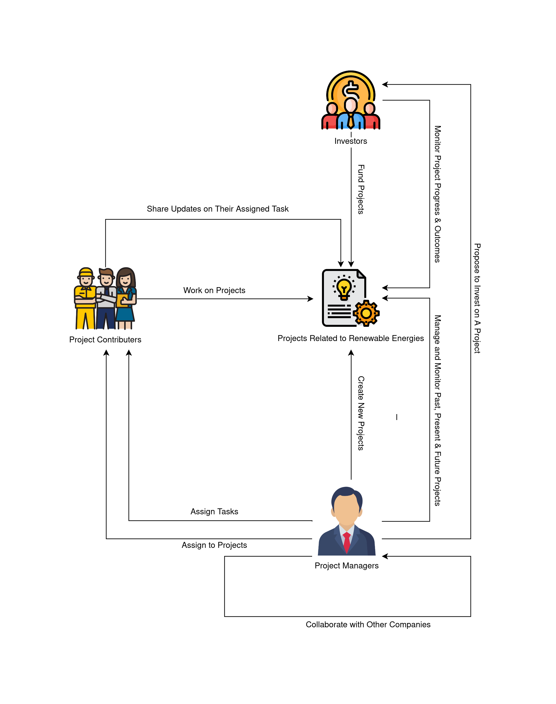
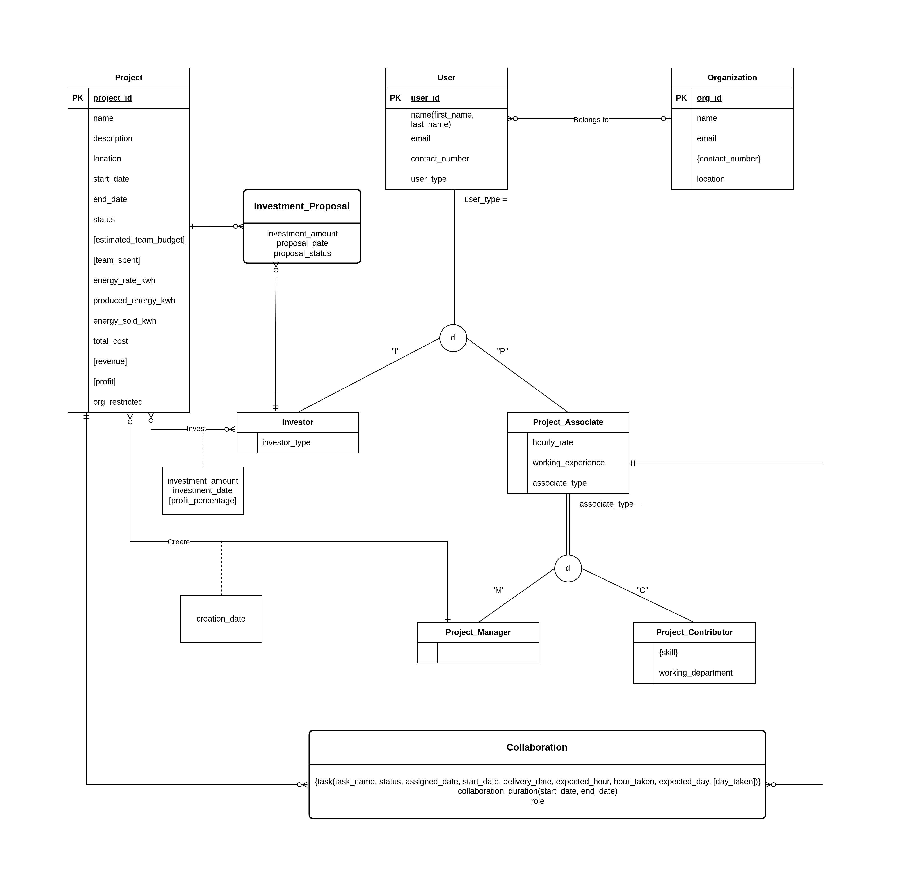
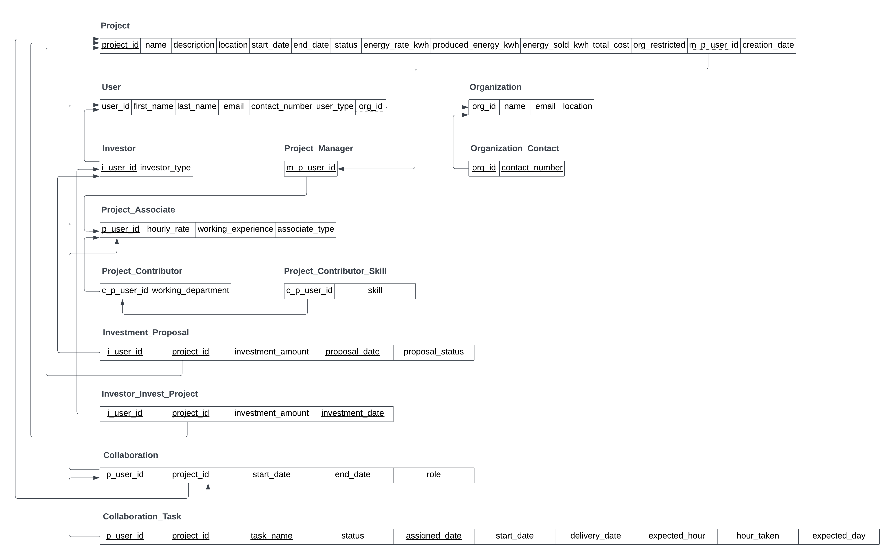

REnizer: A Project Management Platform Specially for Renewable Energy Projects. Here someone can easily create and manage projects. Also investors can invest on projects.

Following is the `Rich Picture` of the system. All the user interactions have shown below.

<picture>
    
</picture>

For designing a proper relation database system the following `Extended Entity Relational Diagram (EERD)` was followed.

<picture>
    
</picture>

Using the `EERD` we have developed the following `Relational Schema`.

<picture>
    
</picture>

To run the project locally please follow the steps provided inside the [renizer-web-readme](renizer-web/README.md).

`Note:` This project is still under development. Most of the features are still missing. 